# Android-Leave-Management-System

An Android application which automates the leave management process in Educational Institutions, by intelligently adapting to HR policy of the organization, decreasing paperwork and enabling the process with efficient record maintenance.

## Existing System

In the existing system many offices follow manual procedure in which employees fill an application form and submit to the respective authorities and have to keep inquiring in the department office regarding the status. Hence it is a time consuming process. Establishment section people have to manually feed application data into computer for record maintenance. All these things make leave management, a tedious task.

## Advantages of Proposed Solution  

- apply for leave at any time, from any place.
- get instant update of application status
- maintains record of previously applied leaves
- Time efficient and does not involve paper work
- strictly follows HR policy of organization
- instant access to who are on leave today or any particular date

## Screenshots  

1. **Staff Home Page**  
  
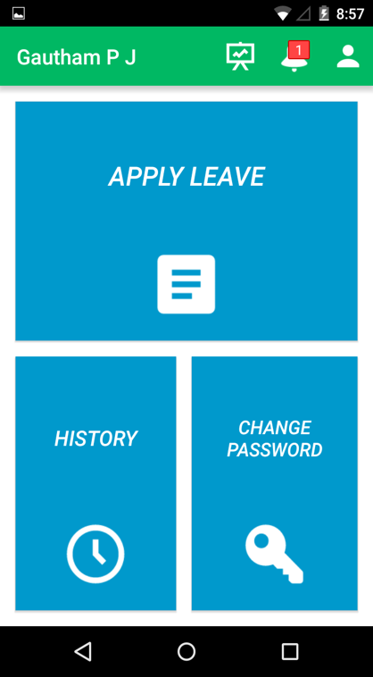 

2. **Leave Application Form**
  
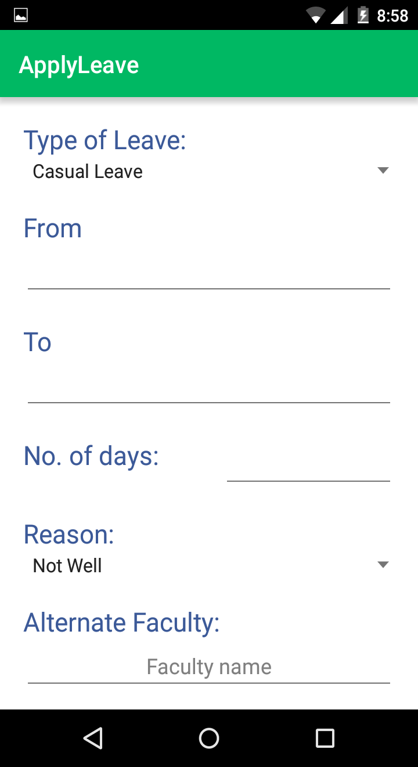

3. **Leave History**
  
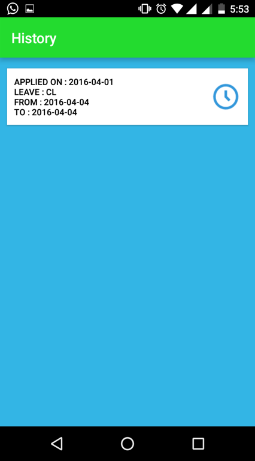

4. **Approval List**
  
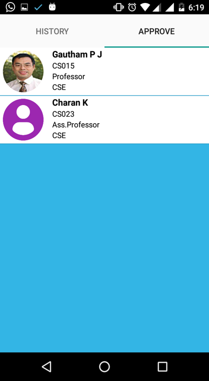

5. **Leave Approval Form**

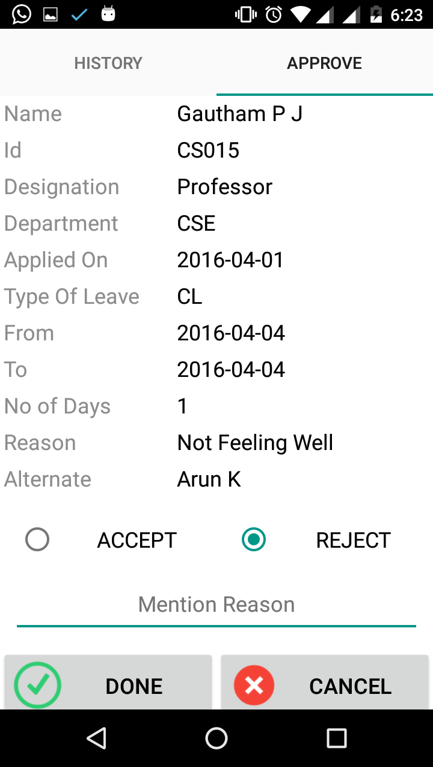

6. **Approval History**

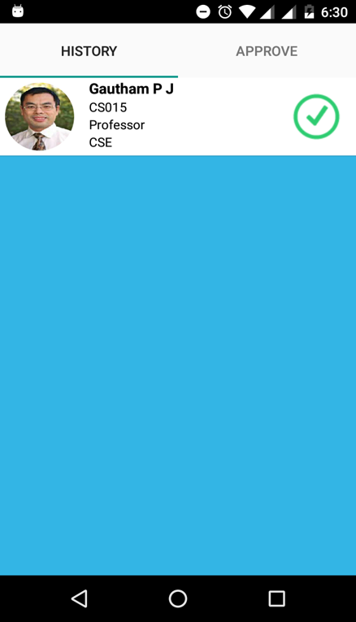

7. **Notification**
  
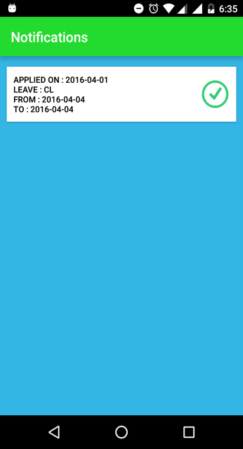

8. **Leave Details**
  
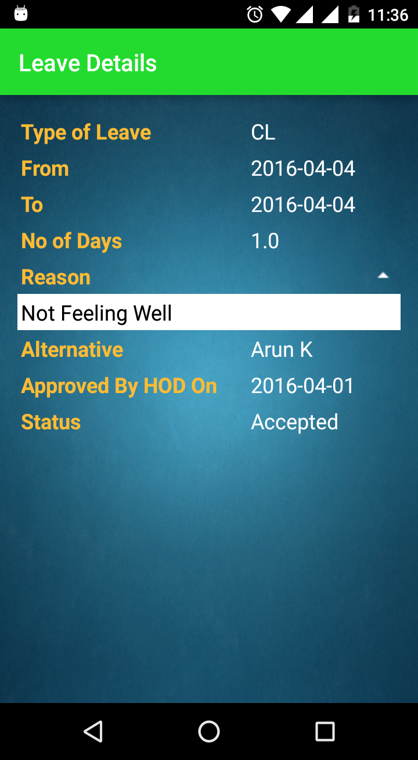

9. **Profile**
  
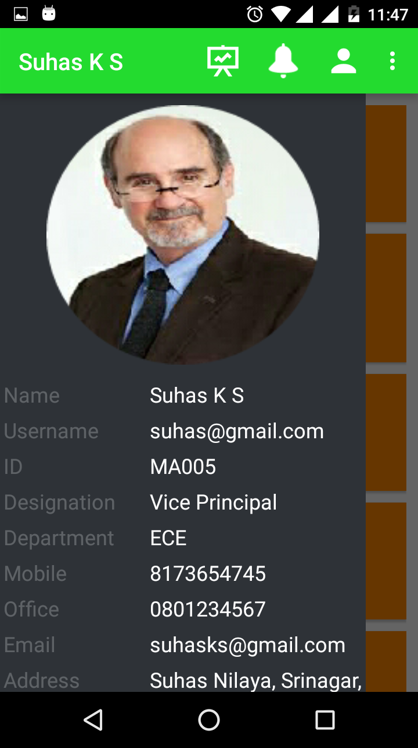

10. **Register Profile**
  
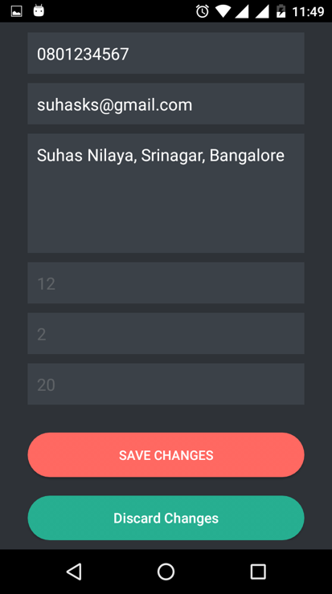

11. **Profile Approval**
  
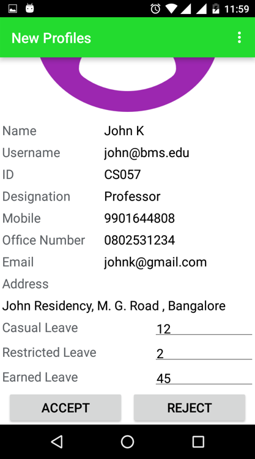

12. **Statistics**
  

